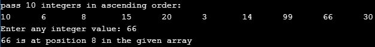
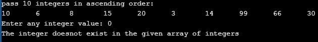

# Experiment - 1
## Aim : Write a program that uses recursive functions to perform the linear search operation for a key value in a given list of integers.   
### Step by step procedure:
1.Create an array with a fixed length, take the size of the array on which linear search is to be performed as input.

2.Take all the elements as input, take the key value from console. 

3.Compare the elements in the array with key value and if we encounter  the key value it will return it's postion. If at all the key value not found it will return 'Element not found'
 ## Output Obtained :
### Output with key value = 66

### Output with key value = 0

