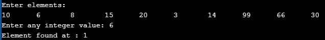
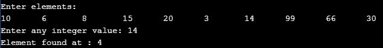
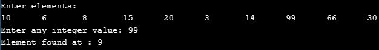

# Experiment - 1
## Aim : Write a program that uses recursive functions to perform the binary search operation for a key value in a given list of integers.   
### Step by step procedure:
1.Create an array with a fixed length, take the size of the array on which binary search is to be performed as input.

2.Take all the elements as input, take the key value from console. 

3.Compare the elements in the array with key value and if we encounter  the key value it will return it's postion. If at all the key value not found it will return 'Element not found'

Elements After sorting :
a[0] = 3 ;  a[1] = 6 ; a[2] = 8 ; a[3] =  10 ; a[4] = 14 ;  a[5] = 15 ; a[6]  =  20 ; a[7] = 30 ; a[8] = 66 ; a[9] = 99
## Key Element = 6
mid = (low + high) / 2
Iteration 1:
low = 0 ; high = 9 ; mid = 4
a[4] = 14;
a[4] > key      [case Failed]
Iteration 2:
low = 0 ; high = 3 ; mid = 1
a[1] = 6;
a[1] == key      [case Passed]
Key value found at index position ‘1’
 ## Output Obtained :
### Output with key value = 6
## Key Element = 14
mid = (low + high) / 2
Iteration 1:
low = 0 ; high = 9 ; mid = 4
a[4] = 14;
a[4] == key      [case Passed]
HENCE, ELEMENT  FOUND AT POSTION ‘4’

### Output with key value = 14

## Key Element =99
mid = (low + high) / 2
Iteration 1:
low = 0 ; high = 9 ; mid = 4
a[4] = 14;
a[4] < key      [case Failed] 
Iteration 2:
low = 5 ; high = 9 ; mid = 7
a[7] = 30;
a[7] < key      [case Failed]
Iteration 3:
low = 8 ; high = 9 ; mid = 8
a[8] = 66;
a[8] < key      [case Failed]
Iteration 4:
low = 9 ; high = 9 ; mid = 9
a[9] =  99;
a[9] == key      [case Passed]

Key value found at index position ‘9’
### Output with key value = 99

